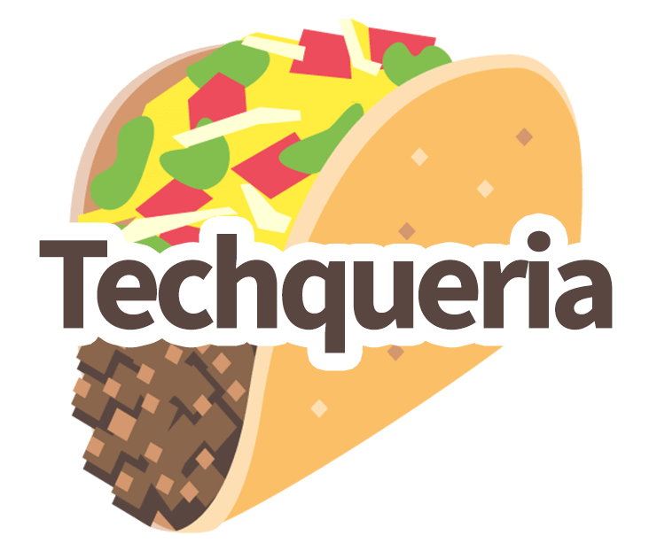

<h1 align="left"> Hey World ! 🤙🏽 
 <br/>
<!--  -->
<!-- <h5 align="left">I'm a Product Manager working on blockchain infrastructure ⛓ and a proud member of the <a href="https://techqueria.org/" target="_blank"> LatinX Tech Community </a></h5>
 -->
 <h4 align="left">Just a Product Manager building products for crypto miners ⛓ ⛏ </h4>
 
<!-- <h4> 📮 Drop me a line ! </h4>

[](https://www.behance.net/cuitlazotlac) 
[](mailto:heyhayssem@gmail.com)
[](https://codepen.io/cuitlazotlac)
[](https://dribbble.com/cuitlazotlac)
[](https://drive.google.com/file/d/1XqK292myheQ53gTAYmz20vpO4cv5Q7Fq/view?usp=sharing) -->

- 👷🏽‍♂️  I’m currently working on a **Startup Project**
- 👨🏽‍💻  Most used line of code `git push -f origin main:main`
- 🌱  I’m currently learning **Blockchain and Distributed Systems**
- 🔭  I’m looking to collaborate **on Open Source Projects 🛠**
 
<h4> 🦥 Languages and Tools :<h4> 

 <!--  PRODUCT DEVELOPMENT RELATED  -->
<!--  -->
<!--  -->


<!--  -->
<!--  -->


---
<!-- <h4> 👨🏽‍💻  My Workspace :</h4>


 -->

<!-- !<h4> 🎧  Spotify Playing : </h4> -->
<!-- !</img> -->

<!-- ---  -->

📉 Coding Stats :
<!--START_SECTION:waka-->

```text
From: 28 October 2022 - To: 04 November 2022

JavaScript   1 hr 2 mins     ██████████░░░░░░░░░░░░░░░   40.50 %
SQL          26 mins         ████▒░░░░░░░░░░░░░░░░░░░░   17.02 %
JSON         17 mins         ██▓░░░░░░░░░░░░░░░░░░░░░░   11.28 %
TypeScript   12 mins         ██░░░░░░░░░░░░░░░░░░░░░░░   08.11 %
CSS          11 mins         ██░░░░░░░░░░░░░░░░░░░░░░░   07.76 %
Other        10 mins         █▓░░░░░░░░░░░░░░░░░░░░░░░   06.92 %
```

<!--END_SECTION:waka-->


<details>
<summary>🐙 GitHub Stats : </summary>
  
</details>
<details>
<summary>👾 Most Used Languages : </summary>

</details>
